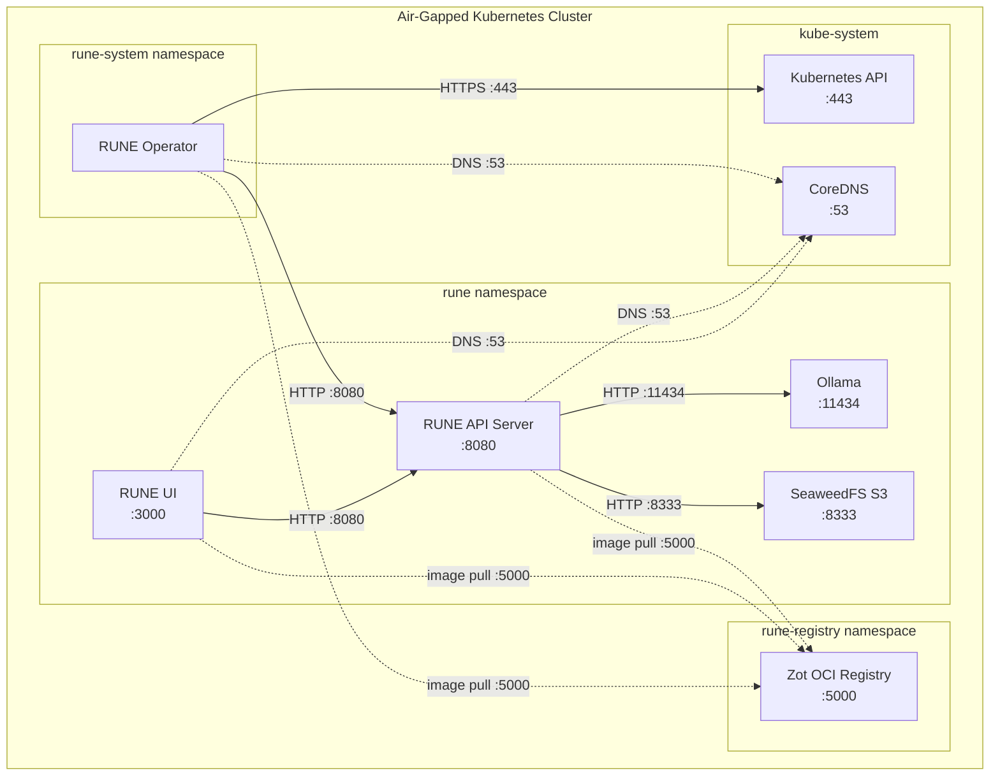
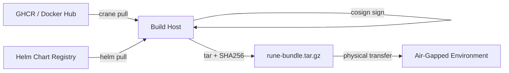
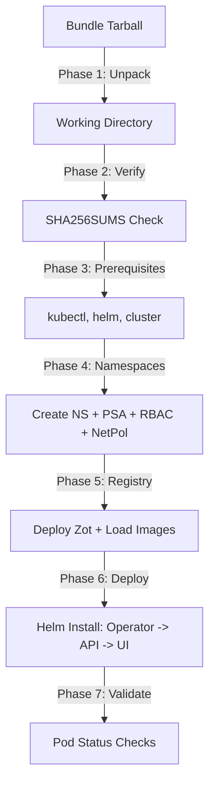

# Architecture Overview

This document describes the architecture of a RUNE air-gapped deployment,
including component layout, data flow, and the security model.

## Component Diagram



## Namespaces

RUNE uses three dedicated namespaces, each with the `restricted` Pod Security
Admission profile enforced:

| Namespace | Purpose | Components |
|---|---|---|
| `rune-registry` | OCI image registry | Zot |
| `rune-system` | Control plane | RUNE Operator |
| `rune` | Application workloads | API Server, UI, Ollama, SeaweedFS |

## Data Flow in Air-Gapped Mode

### Bundle Build (Connected Environment)



1. `build-bundle.sh` pulls container images (OCI layout) and Helm charts from
   upstream registries.
2. Optionally signs all images with cosign.
3. Collects compliance artifacts (SBOMs, VEX documents, attestations).
4. Generates `manifest.json` (machine-readable inventory with digests).
5. Generates `SHA256SUMS` for all files in the bundle.
6. Packages everything into a deterministic, reproducible tarball.

### Bootstrap (Air-Gapped Environment)



1. **Unpack**: Extract the tarball into a temporary working directory.
2. **Verify**: Check SHA256 checksums of all bundle contents. Optionally
   verify cosign signatures.
3. **Prerequisites**: Validate kubectl, helm, and cluster connectivity.
4. **Namespaces**: Create namespaces with PSA labels, apply RBAC,
   NetworkPolicies, and ResourceQuotas.
5. **Registry**: Deploy Zot as a Kubernetes Deployment, load images via
   port-forward and crane.
6. **Deploy**: Install Helm charts in dependency order (operator, API, UI).
   All image references point to the in-cluster Zot registry.
7. **Validate**: Verify all pods are Running across all namespaces.

### Runtime Data Flow

At runtime, no external network access is required. All image pulls resolve to
the in-cluster Zot registry. The API server communicates with Ollama for LLM
inference and SeaweedFS for result storage. The operator watches CRDs via the
Kubernetes API.

## Bundle Contents

```
rune-bundle-<tag>/
  manifest.json          # Machine-readable inventory
  SHA256SUMS             # Integrity checksums for all files
  cosign.pub             # Public key for signature verification (if signed)
  images/                # OCI layout directories, one per image
    rune/
      amd64/
      arm64/
    rune-operator/
    rune-ui/
    rune-docs/
    rune-audit/
    zot-linux-amd64/
    caddy/
    ollama/              # (if --include-ollama)
    seaweedfs/           # (if --include-seaweedfs)
  charts/                # Packaged Helm charts (.tgz)
    rune-<tag>.tgz
    rune-operator-<tag>.tgz
    rune-ui-<tag>.tgz
  compliance/
    sboms/               # CycloneDX SBOMs per image
    vex/                 # Aggregated VEX documents
    attestations/        # SLSA provenance attestations
  scripts/               # Deployment scripts
  manifests/             # Kubernetes manifests (RBAC, NetworkPolicy, quotas)
  values/                # Default Helm values
```

## Security Model

### Supply Chain Integrity

| Control | Implementation |
|---|---|
| Checksum verification | SHA256SUMS generated at build time, verified at deploy time |
| Image signing | Optional cosign signing with key-based verification |
| Offline verification | `--insecure-ignore-tlog` and `--insecure-ignore-sct` flags used because Rekor/Fulcio are unreachable in air-gapped mode |
| SLSA provenance | Build attestations included in the compliance directory |
| SBOM | CycloneDX SBOMs generated per image for vulnerability tracking |
| VEX | Vulnerability Exploitability eXchange documents for known CVE status |

### RBAC

Each component runs with a dedicated ServiceAccount with minimal permissions:

| ServiceAccount | Namespace | Permissions |
|---|---|---|
| `rune-registry` | `rune-registry` | No Kubernetes API access (empty Role) |
| `rune-operator` | `rune-system` | CRD CRUD, namespace-scoped resource management |
| `rune-api` | `rune` | Read-only access to ConfigMaps and Secrets |
| `rune-ui` | `rune` | No Kubernetes API access |

All ServiceAccounts have `automountServiceAccountToken: false` unless API
access is explicitly required.

### Network Policies

Network segmentation follows IEC 62443 SR 5.1 (deny by default):

1. **Default deny**: All ingress and egress traffic is denied in every RUNE
   namespace.
2. **Explicit allow rules**: Each communication path is an individually
   documented network conduit:
   - UI -> API (TCP/8080)
   - Operator -> API (TCP/8080, cross-namespace)
   - API -> Ollama (TCP/11434)
   - API -> SeaweedFS (TCP/8333)
   - All pods -> Registry (TCP/5000, cross-namespace)
   - Operator -> Kubernetes API (TCP/443)
   - All pods -> CoreDNS (UDP+TCP/53)

Enhanced policies for Calico and Cilium are available in
`manifests/network-policies/calico/` and `manifests/network-policies/cilium/`.

### Pod Security

All pods run under the Kubernetes `restricted` Pod Security Standard:

- Non-root user (UID 1000 for Zot)
- No privilege escalation
- Read-only root filesystem
- All Linux capabilities dropped
- Seccomp profile: `RuntimeDefault`

### Resource Governance

ResourceQuotas and LimitRanges prevent resource exhaustion:

- **ResourceQuotas** cap total CPU, memory, pod count, and PVC count per
  namespace.
- **LimitRanges** set default and maximum resource limits per container,
  preventing unbounded consumption by individual workloads.

### IEC 62443 Alignment

| IEC 62443 Requirement | Implementation |
|---|---|
| SR 1.1 (Identification) | Dedicated ServiceAccounts per component |
| SR 2.1 (Authorization) | RBAC with least-privilege roles |
| SR 5.1 (Network segmentation) | Default-deny NetworkPolicies |
| SR 5.2 (Zone boundary protection) | Explicit allow rules per conduit |
| SR 7.6 (Resource availability) | ResourceQuotas and LimitRanges |
| SM-9 (Provenance verification) | Cosign signatures, SHA256 checksums |
| SM-10 (Fail-closed integrity) | Bootstrap exits with code 3 on verification failure |
| DM-4 (Audit logging) | Verification results logged for compliance evidence |
